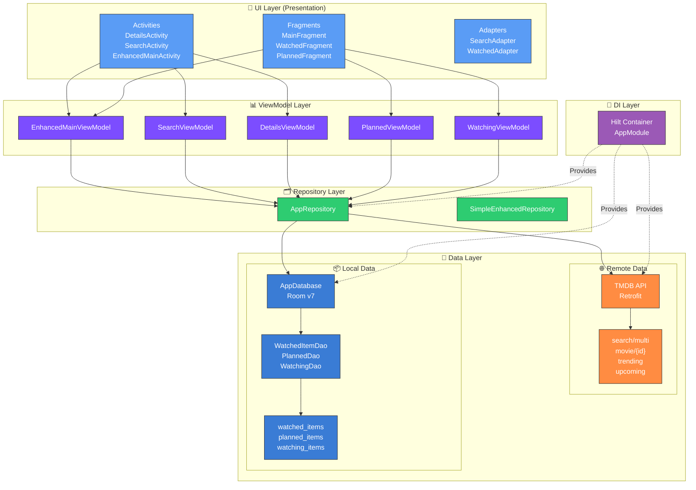
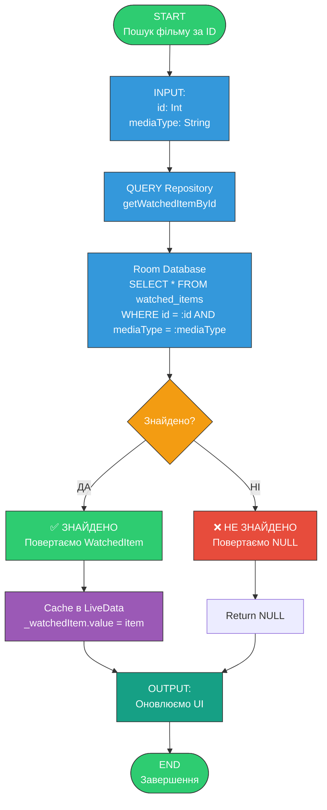
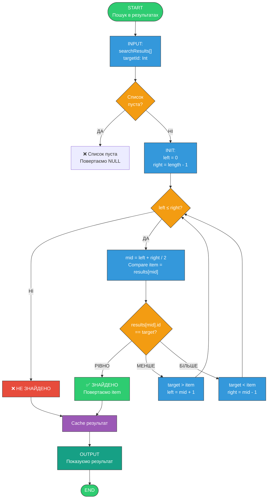
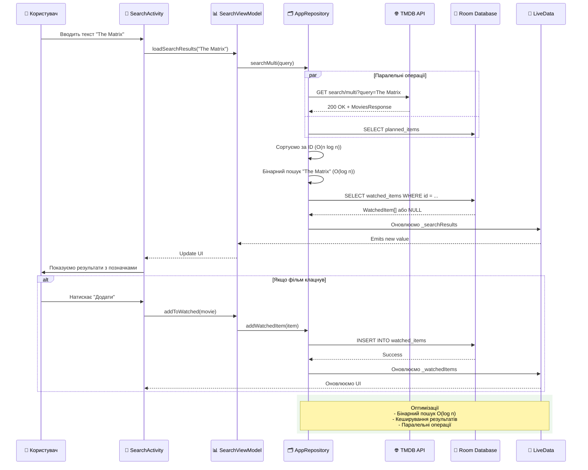

# 🎬 MovieTime Tracker

<div align="center">


**Ваш особистий трекер фільмів та серіалів**

Відстежуйте, що ви дивитесь, плануєте дивитись та вже подивились

[Особливості](#-основні-можливості) • [Технології](#-технології) • [Архітектура](#-архітектура) • [Пошук](#-алгоритми-пошуку-та-оптимізація) • [📋 Алгоритми](ALGORITHMS_AND_STRUCTURES.md) • [Установка](#-установка) • [Скріншоти](#-скріншоти)

</div>

---

## 📱 Про проект

**MovieTime Tracker** — сучасний Android-додаток для відстеження фільмів і серіалів з інтуїтивним інтерфейсом та потужним функціоналом. Додаток використовує **TMDB API** для отримання актуальної інформації про фільми, серіали, акторів та трейлери.

### 🎯 Основні можливості

- ✅ **Відстеження контенту** — додавайте фільми/серіали до списків: переглянуті, дивлюсь, заплановані
- 📊 **Детальна статистика** — загальний час перегляду, кількість переглянутого контенту, середній рейтинг
- 🔍 **Потужний пошук** — знаходьте будь-який фільм/серіал з фільтрацією за типом
- 🌟 **Рейтинги та відгуки** — оцінюйте контент та переглядайте рейтинги TMDB
- 🎭 **Популярні тренди** — актуальні фільми та серіали прямо на головному екрані
- 🎬 **Майбутні прем'єри** — дізнавайтесь про нові релізи завчасно
- 👥 **Соціальні функції** — діліться активністю з друзями (в розробці)
- 🌙 **Темна тема** — комфортний перегляд в будь-який час доби
- 🌐 **Мультимовність** — українська, російська, англійська
- 🎨 **Сучасний дизайн** — Material Design 3 з плавними градієнтами та анімаціями

---

## 🛠 Технології

### Основний стек

| Технологія                | Версія           | Призначення                |
| ------------------------- | ---------------- | -------------------------- |
| **Kotlin**                | 1.9.0            | Основна мова програмування |
| **Android Gradle Plugin** | 8.2.2            | Система збірки             |
| **Java**                  | 17               | Target JVM                 |
| **Min SDK**               | 24 (Android 7.0) | Мінімальна версія Android  |
| **Target SDK**            | 34 (Android 14)  | Цільова версія Android     |
| **Compile SDK**           | 34               | Версія для компіляції      |

### 🏗️ Архітектурні компоненти

#### Android Jetpack

```kotlin
// ViewModel & LiveData - управління станом UI та життєвим циклом
implementation("androidx.lifecycle:lifecycle-viewmodel-ktx:2.7.0")
implementation("androidx.lifecycle:lifecycle-livedata-ktx:2.7.0")

// Navigation Component - навігація між екранами
implementation("androidx.navigation:navigation-fragment-ktx:2.7.6")
implementation("androidx.navigation:navigation-ui-ktx:2.7.6")

// Room Database - локальна база даних
implementation("androidx.room:room-runtime:2.6.1")
implementation("androidx.room:room-ktx:2.6.1")
ksp("androidx.room:room-compiler:2.6.1")
```

**Room Database** — локальна база даних для зберігання:

- Переглянутих фільмів/серіалів
- Запланованих до перегляду
- Контенту, що зараз переглядається
- Рейтингів користувача
- Історії пошуку

### 💉 Dependency Injection

```kotlin
// Hilt - сучасний DI фреймворк від Google
implementation("com.google.dagger:hilt-android:2.48.1")
ksp("com.google.dagger:hilt-compiler:2.48.1")
```

**Hilt (Dagger)** забезпечує:

- Автоматичне створення та ін'єкція залежностей
- Управління життєвим циклом компонентів
- Тестування з фейковими реалізаціями
- ViewModels, Repository, Network модулів

### 🌐 Мережа та API

```kotlin
// Retrofit - HTTP клієнт
implementation("com.squareup.retrofit2:retrofit:2.9.0")
implementation("com.squareup.retrofit2:converter-gson:2.9.0")

// OkHttp - логування запитів
implementation("com.squareup.okhttp3:logging-interceptor:4.12.0")
```

**Retrofit + OkHttp** для роботи з **TMDB API**:

- Пошук фільмів та серіалів
- Отримання деталей контенту
- Інформація про акторів та трейлери
- Популярні тренди
- Майбутні релізи

**TMDB API Endpoints:**

- `/search/multi` — пошук фільмів/серіалів
- `/movie/{id}` — деталі фільму
- `/tv/{id}` — деталі серіалу
- `/trending/{media_type}/{time_window}` — тренди
- `/movie/upcoming` — майбутні прем'єри

### 🎨 UI/UX Бібліотеки

```kotlin
// Material Design 3
implementation("com.google.android.material:material:1.11.0")

// Coil - завантаження та кешування зображень
implementation("io.coil-kt:coil:2.5.0")

// Lottie - векторні анімації
implementation("com.airbnb.android:lottie:6.2.0")

// Shimmer - ефект завантаження
implementation("com.facebook.shimmer:shimmer:0.5.0")

// RecyclerView, CardView, SwipeRefresh
implementation("androidx.recyclerview:recyclerview:1.3.2")
implementation("androidx.cardview:cardview:1.0.0")
implementation("androidx.swiperefreshlayout:swiperefreshlayout:1.1.0")
```

**Coil** — сучасна бібліотека для зображень:

- Автоматичне кешування
- Підтримка placeholder та error
- Трансформації (rounded corners, blur)
- Оптимізація пам'яті

**Lottie** — векторні анімації JSON:

- Легкі анімації без великих GIF
- Плавні переходи
- Анімація завантаження

### ⚡ Асинхронність

```kotlin
// Kotlin Coroutines - асинхронне програмування
implementation("org.jetbrains.kotlinx:kotlinx-coroutines-core:1.7.3")
implementation("org.jetbrains.kotlinx:kotlinx-coroutines-android:1.7.3")

// Paging 3 - пагінація списків
implementation("androidx.paging:paging-runtime-ktx:3.2.1")
```

**Coroutines** забезпечують:

- Мережеві запити без блокування UI
- Робота з базою даних у фоні
- Легке управління паралельними задачами
- Structured concurrency

**Paging 3** — ефективна пагінація:

- Завантаження даних порціями
- Автоматична індикація завантаження
- Кешування та повторні спроби

### 🔧 Інші інструменти

```kotlin
// KSP - Kotlin Symbol Processing (замість KAPT)
id("com.google.devtools.ksp") version "1.9.0-1.0.13"

// ViewBinding - безпечний доступ до View
buildFeatures {
    viewBinding = true
}

// Preferences - збереження налаштувань
implementation("androidx.preference:preference-ktx:1.2.1")
```

---

## 🏛️ Архітектура

### MVVM Pattern (Model-View-ViewModel)



### MVVM Детальна діаграма

```
┌─────────────────────────────────────────────┐
│                    View                      │
│  (Activities, Fragments, XML Layouts)        │
│  - DetailsActivity                          │
│  - SearchActivity                           │
│  - EnhancedMainActivity                     │
└─────────────┬───────────────────────────────┘
              │ observes LiveData
              │ user actions
              ▼
┌─────────────────────────────────────────────┐
│                 ViewModel                    │
│  - EnhancedMainViewModel                    │
│  - SearchViewModel                          │
│  - DetailsViewModel                         │
│  Holds UI state, handles user actions       │
│  LiveData<List<T>>, MutableLiveData<T>      │
└─────────────┬───────────────────────────────┘
              │ calls suspend fun
              │ viewModelScope.launch
              ▼
┌─────────────────────────────────────────────┐
│                Repository                    │
│  - AppRepository                            │
│  - SimpleEnhancedRepository                 │
│  Coordinates data from API and Database     │
│  Business Logic & Binary Search             │
└────────┬────────────────────┬───────────────┘
         │                    │
         │ Retrofit.call()    │ Room.query()
         ▼                    ▼
┌─────────────────┐  ┌─────────────────┐
│   Remote Data   │  │   Local Data    │
│   (TMDB API)    │  │ (Room Database) │
│   - TmdbApi     │  │ - WatchedItemDao│
│   - OkHttp      │  │ - PlannedDao    │
│   - GsonConverter│  │ - WatchingDao   │
└─────────────────┘  └─────────────────┘
```

### Структура модулів

```
app/src/main/
├── java/com/example/movietime/
│   ├── data/
│   │   ├── local/           # Room Database
│   │   │   ├── dao/         # Data Access Objects
│   │   │   ├── entities/    # Database entities
│   │   │   └── AppDatabase.kt
│   │   ├── remote/          # API
│   │   │   ├── api/         # Retrofit interfaces
│   │   │   └── models/      # Response models
│   │   └── repository/      # Repository pattern
│   ├── di/                  # Hilt modules
│   │   ├── DatabaseModule.kt
│   │   ├── NetworkModule.kt
│   │   └── RepositoryModule.kt
│   ├── ui/
│   │   ├── main/            # Головний екран
│   │   ├── search/          # Пошук
│   │   ├── details/         # Деталі фільму/серіалу
│   │   ├── watched/         # Переглянуті
│   │   ├── planned/         # Заплановані
│   │   ├── watching/        # Дивлюсь зараз
│   │   ├── settings/        # Налаштування
│   │   └── adapters/        # RecyclerView адаптери
│   ├── util/                # Утиліти
│   └── MovieTimeApp.kt      # Application клас
└── res/
    ├── layout/              # XML layouts
    ├── drawable/            # Градієнти, іконки
    ├── values/              # Українська (default)
    ├── values-en/           # Англійська
    ├── values-ru/           # Російська
    └── values-night/        # Темна тема
```

### Ключові класи

#### Data Layer

```kotlin
// Room Entity
@Entity(tableName = "watched_movies")
data class WatchedMovie(
    @PrimaryKey val id: Int,
    val title: String,
    val posterPath: String?,
    val rating: Float?,
    val watchedDate: Long,
    val runtime: Int?
)

// DAO
@Dao
interface WatchedMovieDao {
    @Query("SELECT * FROM watched_movies ORDER BY watchedDate DESC")
    fun getAllWatchedMovies(): Flow<List<WatchedMovie>>

    @Insert(onConflict = OnConflictStrategy.REPLACE)
    suspend fun insertWatchedMovie(movie: WatchedMovie)
}

// Repository
class MovieRepository @Inject constructor(
    private val apiService: TmdbApiService,
    private val watchedMovieDao: WatchedMovieDao
) {
    fun searchMovies(query: String): Flow<PagingData<Movie>> {
        // Використовує Paging 3
    }

    suspend fun getMovieDetails(movieId: Int): Result<MovieDetails> {
        // Retrofit call
    }
}
```

#### Presentation Layer

```kotlin
@HiltViewModel
class EnhancedMainViewModel @Inject constructor(
    private val movieRepository: MovieRepository,
    private val tvRepository: TvShowRepository
) : ViewModel() {

    private val _watchedMovies = MutableLiveData<List<WatchedMovie>>()
    val watchedMovies: LiveData<List<WatchedMovie>> = _watchedMovies

    fun loadStatistics() {
        viewModelScope.launch {
            movieRepository.getWatchedMovies()
                .collect { movies ->
                    _watchedMovies.value = movies
                }
        }
    }
}
```

---

## 🎨 UI/UX Дизайн

### Material Design 3

Додаток використовує найновіші компоненти Material Design 3:

- **MaterialCardView** — картки з elevation та ripple ефектами
- **MaterialButton** — кнопки з outlined, filled, text стилями
- **MaterialSwitch** — перемикачі налаштувань
- **NavigationView** — бічне меню
- **BottomNavigationView** — нижня навігація
- **Toolbar** — верхня панель з gradієнтом
- **NestedScrollView** — плавна прокрутка

### Колірна схема

#### Світла тема

```xml
<color name="primary">#1E3A5F</color>
<color name="accent">#5A9CF5</color>
<color name="highlight">#7C4DFF</color>
<color name="success">#2ECC71</color>
<color name="background">#F5F7FA</color>
<color name="surface">#FFFFFF</color>
```

#### Темна тема (GitHub-inspired)

```xml
<color name="primary_dark">#2A4A6F</color>
<color name="background_dark">#0D1117</color>
<color name="surface_dark">#161B22</color>
<color name="text_primary_dark">#C9D1D9</color>
<color name="accent_dark">#7EB5FF</color>
```

### Градієнти

**Багатошарові градієнти для глибини:**

```xml
<!-- Головний градієнт header -->
<layer-list>
    <item>
        <gradient angle="160"
            startColor="#0F172A"
            centerColor="#1E293B"
            endColor="#0F172A" />
    </item>
    <item>
        <gradient angle="45"
            startColor="#00000000"
            centerColor="#1A3A5C"
            endColor="#00000000" />
    </item>
    <item>
        <gradient angle="90"
            startColor="#00000000"
            centerColor="#0D253A"
            endColor="#14375A" />
    </item>
</layer-list>
```

### Анімації

- **Ripple effects** на всіх інтерактивних елементах
- **Fade in/out** для переходів між фрагментами
- **Slide animations** для drawer та bottom sheets
- **Shimmer effect** під час завантаження
- **Spring animations** для плавних рухів
- **Lottie animations** для порожніх станів

---

## � Алгоритми пошуку та оптимізація

### Блок-схема: Бінарний пошук у БД



### Бінарний пошук у відсортованому списку результатів



### Діаграма: Data Flow пошуку фільму



### Таблиця: Часова складність операцій

| Операція                 | Найгірший випадок | Середній   | Найкращий | Примітка            |
| ------------------------ | ----------------- | ---------- | --------- | ------------------- |
| Пошук в БД (PRIMARY KEY) | O(log n)          | O(log n)   | O(1)      | Room індексує KEY   |
| Бінарний пошук в масиві  | O(log n)          | O(log n)   | O(1)      | Потребує сортування |
| Лінійний пошук           | O(n)              | O(n/2)     | O(1)      | Без сортування      |
| INSERT/DELETE в БД       | O(log n)          | O(log n)   | O(1)      | B+ tree структура   |
| SELECT ALL з сортуванням | O(n log n)        | O(n log n) | O(n)      | SQL ORDER BY        |

---

## �📦 Установка

### Вимоги

- **Android Studio** Hedgehog (2023.1.1) або новіше
- **JDK 17** або новіше
- **Android SDK** 34
- **Gradle** 8.2+
- **TMDB API Key** (безкоштовна реєстрація на [themoviedb.org](https://www.themoviedb.org/))

### Крок 1: Клонування репозиторію

```bash
git clone https://github.com/yourusername/MovieTimeTracker.git
cd MovieTimeTracker
```

### Крок 2: Налаштування TMDB API Key

1. Зареєструйтесь на [TMDB](https://www.themoviedb.org/signup)
2. Отримайте API Key в [налаштуваннях API](https://www.themoviedb.org/settings/api)
3. Створіть файл `local.properties` в корені проекту:

```properties
# local.properties
TMDB_API_KEY=your_api_key_here
```

### Крок 3: Збірка проекту

```bash
# Windows
.\gradlew assembleDebug

# Linux/Mac
./gradlew assembleDebug
```

### Крок 4: Запуск

- Відкрийте проект в Android Studio
- Підключіть пристрій або запустіть емулятор
- Натисніть **Run** (Shift+F10)

---

## 🗂️ Структура бази даних

### Таблиці Room Database

#### watched_movies

```sql
CREATE TABLE watched_movies (
    id INTEGER PRIMARY KEY,
    title TEXT NOT NULL,
    posterPath TEXT,
    rating REAL,
    watchedDate INTEGER NOT NULL,
    runtime INTEGER,
    genres TEXT
);
```

#### watched_tv_shows

```sql
CREATE TABLE watched_tv_shows (
    id INTEGER PRIMARY KEY,
    title TEXT NOT NULL,
    posterPath TEXT,
    rating REAL,
    watchedDate INTEGER NOT NULL,
    episodesWatched INTEGER,
    totalEpisodes INTEGER
);
```

#### planned_content

```sql
CREATE TABLE planned_content (
    id INTEGER PRIMARY KEY,
    title TEXT NOT NULL,
    mediaType TEXT NOT NULL, -- 'movie' or 'tv'
    posterPath TEXT,
    addedDate INTEGER NOT NULL,
    priority INTEGER DEFAULT 0
);
```

#### watching_now

```sql
CREATE TABLE watching_now (
    id INTEGER PRIMARY KEY,
    title TEXT NOT NULL,
    mediaType TEXT NOT NULL,
    posterPath TEXT,
    currentEpisode INTEGER,
    totalEpisodes INTEGER,
    lastWatchedDate INTEGER
);
```

---

## 🌐 API Інтеграція

### TMDB API v3

**Base URL:** `https://api.themoviedb.org/3/`

#### Основні ендпоінти:

```kotlin
interface TmdbApiService {

    // Пошук
    @GET("search/multi")
    suspend fun searchMulti(
        @Query("api_key") apiKey: String,
        @Query("query") query: String,
        @Query("language") language: String,
        @Query("page") page: Int
    ): SearchResponse

    // Деталі фільму
    @GET("movie/{movie_id}")
    suspend fun getMovieDetails(
        @Path("movie_id") movieId: Int,
        @Query("api_key") apiKey: String,
        @Query("language") language: String
    ): MovieDetails

    // Трендові
    @GET("trending/{media_type}/{time_window}")
    suspend fun getTrending(
        @Path("media_type") mediaType: String,
        @Path("time_window") timeWindow: String,
        @Query("api_key") apiKey: String
    ): TrendingResponse

    // Майбутні релізи
    @GET("movie/upcoming")
    suspend fun getUpcoming(
        @Query("api_key") apiKey: String,
        @Query("language") language: String,
        @Query("page") page: Int
    ): UpcomingResponse
}
```

### Конфігурація Retrofit

```kotlin
@Module
@InstallIn(SingletonComponent::class)
object NetworkModule {

    @Provides
    @Singleton
    fun provideOkHttpClient(): OkHttpClient {
        return OkHttpClient.Builder()
            .addInterceptor(HttpLoggingInterceptor().apply {
                level = HttpLoggingInterceptor.Level.BODY
            })
            .connectTimeout(30, TimeUnit.SECONDS)
            .readTimeout(30, TimeUnit.SECONDS)
            .build()
    }

    @Provides
    @Singleton
    fun provideRetrofit(okHttpClient: OkHttpClient): Retrofit {
        return Retrofit.Builder()
            .baseUrl("https://api.themoviedb.org/3/")
            .client(okHttpClient)
            .addConverterFactory(GsonConverterFactory.create())
            .build()
    }

    @Provides
    @Singleton
    fun provideApiService(retrofit: Retrofit): TmdbApiService {
        return retrofit.create(TmdbApiService::class.java)
    }
}
```

---

## 🌍 Мультимовність

Додаток підтримує 3 мови з автоматичним перемиканням:

| Мова          | Код  | Прогрес           |
| ------------- | ---- | ----------------- |
| 🇺🇦 Українська | `uk` | 100% (205 рядків) |
| 🇷🇺 Російська  | `ru` | 100% (205 рядків) |
| 🇬🇧 Англійська | `en` | 100% (205 рядків) |

**Структура:**

```
res/
├── values/           # Українська (default)
├── values-en/        # English
└── values-ru/        # Русский
```

**Зміна мови:**

- Налаштування → Мова додатку → Вибрати мову
- Додаток автоматично перезавантажується
- TMDB контент також змінює мову

---

## ⚙️ Налаштування

### Доступні налаштування

#### Зовнішній вигляд

- ☀️ **Тема** — Світла / Темна / Системна
- 🌐 **Мова додатку** — Українська / Російська / Англійська
- 🎬 **Мова контенту TMDB** — Окремо для описів фільмів
- ⭐ **Показувати рейтинги** — На карточках
- 📱 **Компактний режим** — Більше контенту на екрані

#### Контент

- 🎥 **Автовідтворення трейлерів**
- 🔔 **Сповіщення** — Нові релізи, нагадування

#### Дані

- 🗑️ **Очистити кеш** — Зображення та тимчасові файли
- 💾 **Експорт даних** — Резервна копія
- 📥 **Імпорт даних** — Відновлення
- ⚠️ **Очистити всі дані** — Повне скидання

### SharedPreferences ключі

```kotlin
const val PREF_THEME = "pref_theme"              // "system", "light", "dark"
const val PREF_LANG = "pref_lang"                // "uk", "ru", "en"
const val PREF_TMDB_LANG = "pref_tmdb_lang"      // "uk", "ru", "en"
const val PREF_SHOW_RATINGS = "pref_show_ratings" // Boolean
const val PREF_COMPACT_MODE = "pref_compact_mode" // Boolean
const val PREF_AUTOPLAY = "pref_autoplay_trailers" // Boolean
```

---

## 📸 Скріншоти

### Головний екран

- 👋 Персоналізоване привітання
- 📊 Загальна статистика (час перегляду, кількість фільмів/серіалів)
- 🎯 Швидкі дії (пошук, тренди, прем'єри, друзі)
- 📁 Категорії (переглянуті, заплановані, дивлюсь)

### Пошук

- 🔍 Real-time пошук з debounce
- 🎭 Фільтрація (все / фільми / серіали)
- 📜 Історія пошуків
- 🌟 Популярні зараз
- ♾️ Безкінечна прокрутка з пагінацією

### Деталі контенту

- 🎬 Постер та backdrop
- 📝 Опис, жанри, рейтинг
- ⏱️ Тривалість, дата виходу
- ⭐ Можливість оцінити
- ➕ Додати до списку
- 🎥 Перегляд трейлера

### Списки

- ✅ Переглянуті — з датою та рейтингом
- 📌 Заплановані — з пріоритетом
- ▶️ Дивлюсь — з прогресом епізодів

### Темна тема

- 🌙 GitHub-style dark palette
- 👁️ Зручна для очей вночі
- 🎨 Збережені акценти
- 🔄 Автоматичне перемикання

---

## 🚀 Roadmap

### Версія 1.1 (Coming Soon)

- [ ] 🎞️ Трейлери всередині додатку
- [ ] 📝 Власні відгуки та нотатки
- [ ] 📈 Розширена статистика з графіками
- [ ] 🔖 Теги та власні категорії
- [ ] 🔔 Push-сповіщення про нові серії

### Версія 1.2

- [ ] 👥 Соціальні функції (друзі, обмін списками)
- [ ] 🏆 Досягнення та значки
- [ ] 📊 Порівняння з друзями
- [ ] 💬 Коментарі до фільмів
- [ ] 🎯 Рекомендації на основі переглядів

### Версія 2.0

- [ ] 🎮 Gamification елементи
- [ ] 🌐 Синхронізація між пристроями
- [ ] 📱 Widget для головного екрану
- [ ] 🎨 Додаткові теми оформлення
- [ ] 🔐 Профіль користувача з авторизацією

---

## 🧪 Тестування

### Unit Tests

```bash
.\gradlew test
```

### Instrumentation Tests

```bash
.\gradlew connectedAndroidTest
```

### Покриття тестами

- ViewModel логіка
- Repository операції
- Database запити
- API парсинг

---

## 🤝 Внесок у проект

Ми відкриті до будь-яких пропозицій та покращень!

### Як допомогти:

1. **Fork** репозиторію
2. Створіть **feature branch** (`git checkout -b feature/AmazingFeature`)
3. **Commit** зміни (`git commit -m 'Add some AmazingFeature'`)
4. **Push** до гілки (`git push origin feature/AmazingFeature`)
5. Відкрийте **Pull Request**

### Правила коду:

- Використовуйте **Kotlin coding conventions**
- Додавайте **коментарі** до складних частин
- Пишіть **unit tests** для нової функціональності
- Оновлюйте **README** при необхідності

---

## 📄 Ліцензія

Цей проект ліцензовано під **MIT License** — дивіться файл [LICENSE](LICENSE) для деталей.

```
MIT License

Copyright (c) 2024 MovieTime Tracker

Permission is hereby granted, free of charge, to any person obtaining a copy
of this software and associated documentation files...
```

---

## 👨‍💻 Автор

**MovieTime Tracker Team**

- 📧 Email: support@movietime.app
- 🌐 Website: [movietime.app](https://movietime.app)
- 🐦 Twitter: [@MovieTimeApp](https://twitter.com/MovieTimeApp)
- 📱 Telegram: [@MovieTimeSupport](https://t.me/MovieTimeSupport)

---

## 🙏 Подяки

- **[TMDB](https://www.themoviedb.org/)** — за чудове API
- **[Material Design](https://m3.material.io/)** — за дизайн систему
- **[Android Developers](https://developer.android.com/)** — за документацію
- **[Stack Overflow](https://stackoverflow.com/)** — за допомогу спільноти
- **[Coil](https://coil-kt.github.io/coil/)** — за бібліотеку зображень
- **[Lottie](https://airbnb.design/lottie/)** — за анімації

---

## 📚 Корисні посилання

### Документація

- [Android Developers](https://developer.android.com/)
- [Kotlin Documentation](https://kotlinlang.org/docs/home.html)
- [TMDB API Docs](https://developers.themoviedb.org/3)
- [Material Design 3](https://m3.material.io/)

### Бібліотеки

- [Hilt](https://dagger.dev/hilt/)
- [Room Database](https://developer.android.com/training/data-storage/room)
- [Retrofit](https://square.github.io/retrofit/)
- [Coroutines](https://kotlinlang.org/docs/coroutines-overview.html)
- [Paging 3](https://developer.android.com/topic/libraries/architecture/paging/v3-overview)

### Дизайн

- [Material Components](https://github.com/material-components/material-components-android)
- [Color Tool](https://material.io/resources/color/)
- [Icon Library](https://fonts.google.com/icons)

---

<div align="center">

**⭐ Якщо вам сподобався проект, поставте зірку! ⭐**

Made with ❤️ by MovieTime Team

[⬆ Нагору](#-movietime-tracker)

</div>

---

## 📋 Алгоритми та Структури Даних

### 📚 Повний аналіз алгоритмів і структур

**Детальний документ:** [ALGORITHMS_AND_STRUCTURES.md](ALGORITHMS_AND_STRUCTURES.md)

Документ містить:

1. **Алгоритм віртуалізації списку (RecyclerView)**
   - Як RecyclerView економить память
   - DiffUtil та Myers' diff algorithm
   - Де використовується в UI (5+ місць)

2. **Алгоритм лінійного пошуку**
   - Пошук в тексті: `indexOf()`
   - Фільтрування за типом: `filterIsInstance<T>()`
   - Фільтрування за рейтингом: `filter { ... }`
   - Видалення дублікатів: `removeAll()` та `filter()`
   - 6 конкретних місць в коді з прикладами

3. **Алгоритм хеш-таблиці (Hash Table)**
   - HashMap для кеширування результатів пошуку (O(1))
   - LinkedHashMap для дедублікації TMDB результатів (O(1))
   - Map для трансліберації 30+ кирилічних символів (O(1))
   - Кеш улюблених пошуків
   - 4 конкретних місця з аналізом продуктивності

4. **Інші алгоритми**
   - Levenshtein (редакційна відстань) для нечіткого пошуку
   - Unicode Normalization для нормалізації тексту
   - Детекція мови (Cyrillic vs Latin)
   - Sorting (Quicksort/Timsort) для сортування результатів

5. **Матриця алгоритмів**
   - Таблиця всіх алгоритмів з часовою складністю
   - Кількість місць використання
   - Максимальна кількість елементів

6. **Практичні приклади**
   - Повний цикл пошуку з діаграмою
   - Трансліберація в реальному часі
   - Кеширування результатів
   - UI потоку обробки запитів

### Ключові цифри

| Показник | Значення |
|----------|----------|
| Алгоритмів використовується | 5+ |
| Лінійних пошуків | 6 місць |
| Хеш-таблиць | 4 типи |
| Максимум елементів у списку | 500+ |
| Кеш запитів | до 50+ результатів |
| Трансліберація символів | 30+ кирилічних знаків |
| API запитів одночасно | до 6 |
| Фреймворків/бібліотек | 30+ |

---

## 📞 Контакти та Ліцензія

### Автор

Розроблено як навчальний проект для демонстрації сучасних практик Android розробки.

### Ліцензія

Цей проект ліцензований під MIT License — див. [LICENSE](LICENSE) для деталей.

### Подяка

- **TMDB** — за безкоштовний API для фільмів та серіалів
- **Google** — за Android Framework та Jetpack компоненти
- **Airbnb** — за Lottie та витончених анімацій
- **Square** — за Retrofit, OkHttp та інші бібліотеки

---

**Останнє оновлення:** 17 грудня 2025  
**Версія:** 1.0.0  
**Статус:** Активно розробляється
